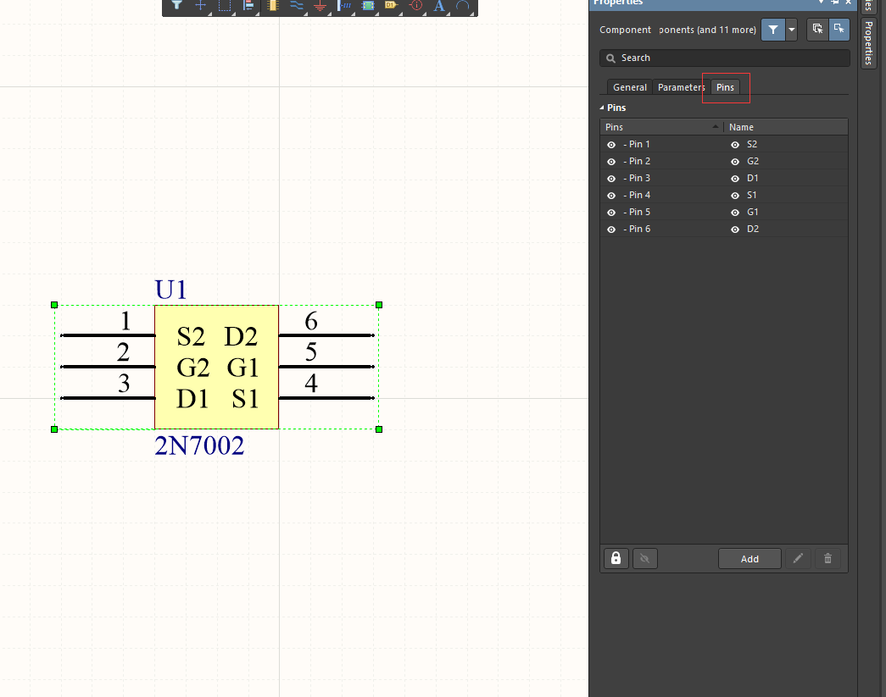
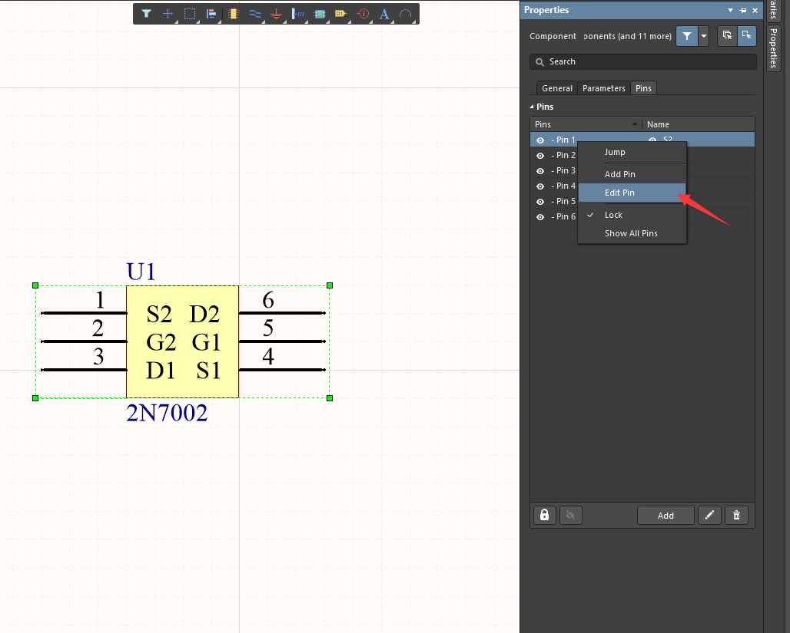
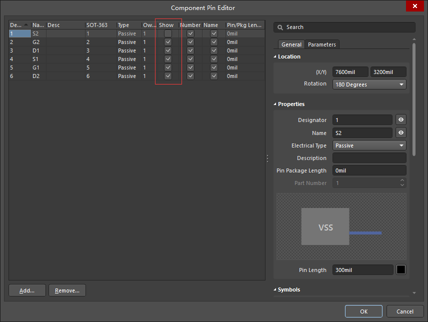

# Hide Pins in Altium Designer

Altium Designer版本：AD 18.1.7

隐藏不需要的引脚。  

1. 双击需要操作的元器件，右侧出现改元器件的属性框，选择“Pins"。  

2. 选中需要操作的引脚，右键，再选择“Edit Pin"。  

3. 在出现的“Component Pin Editor”框中，将需要隐藏的引脚的show一栏的√去掉，再点击确定。  

4. 效果如下，引脚1被隐藏。  

