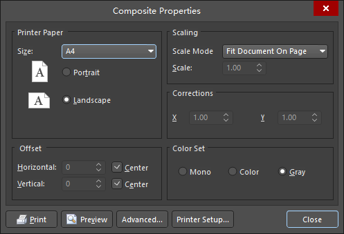

# Printing Silk Screen of Altium Designer

Altium Designer版本：AD 18.1.7

AD里打印丝印图，有两个方法，工具栏下的 “File/Smart PDF” 和 “File/Print Preview”  

## 参考链接

1. [AD9打印丝印层](https://www.cnblogs.com/killer-xc/p/4397546.html)

## 注意

一般我都是用第二种方法（File/Print Preview），比较简单，效果也够用，有一点需要注意的就是参考链接里的图十五的步骤。  
不做这个步骤的话，线条默认是灰色的，打印出来效果不好，改成黑色的话打印出来效果更清晰。

## 常见问题

在打印丝印的时候，打印预览的时候会发现打印的图很小或者很偏，可以通过修改工具栏下的“File/Page Setup”参数。  

修改Scaling里的Scale Mode为Scaled Print后，可以修改Scale来调整大小比例，进行缩放。  

修改offset可以修改打印的图像在纸张上的位置。