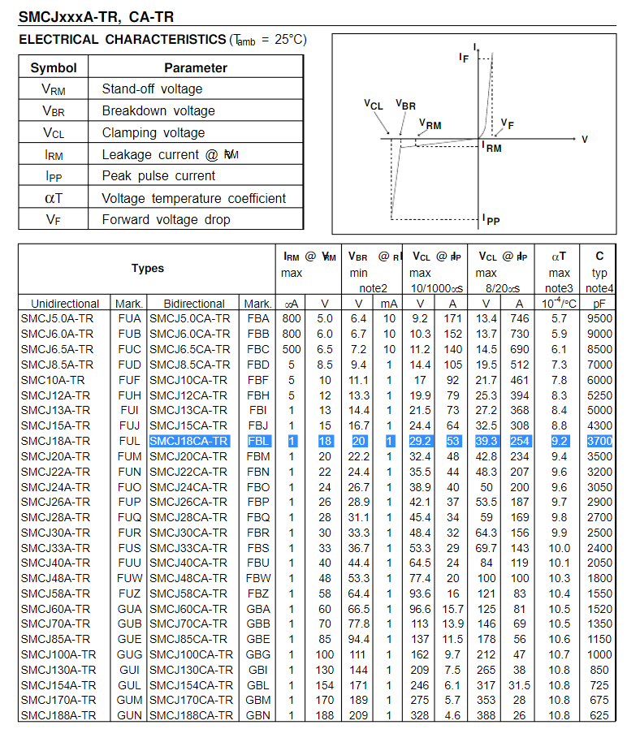
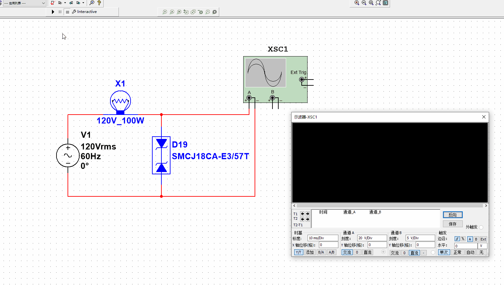
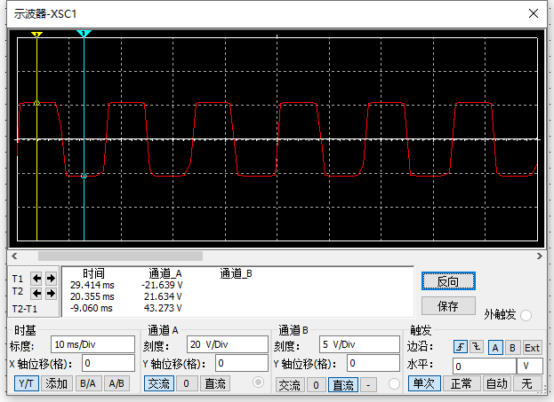
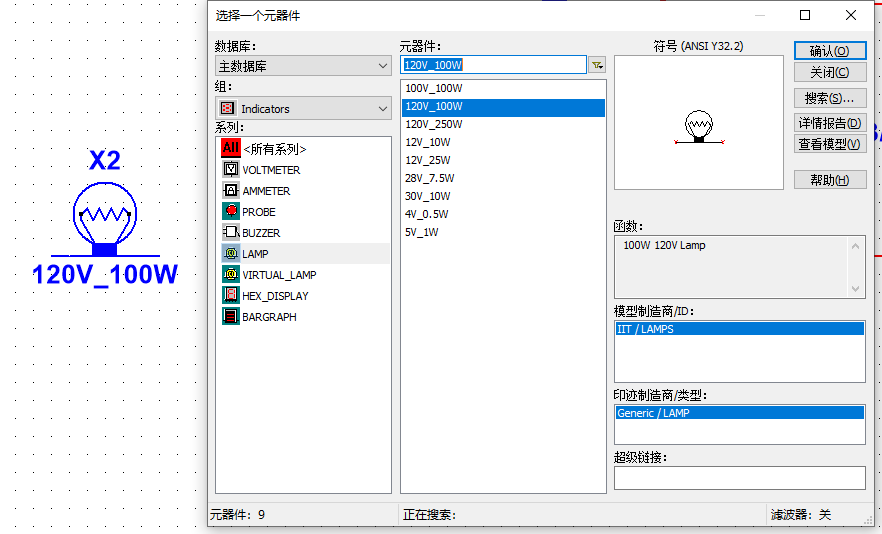
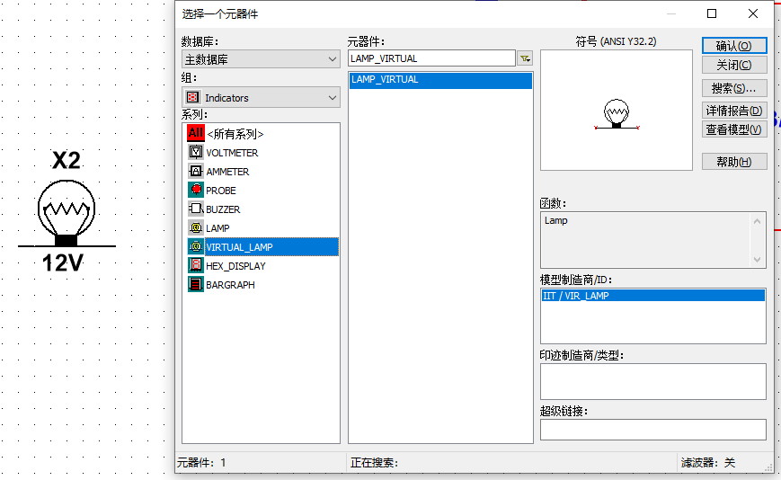

# 双向TVS

1. 双向TVS与双向稳压管类似。  
下图是SMCJ18CA的技术手册，其中Breakdown voltage 击穿电压为20V。  
  

2. multisim仿真电路如下，SMJ18CA两端电压是120的交流电，当交流电电压超过20V时，击穿TVS管，TVS管两端电压截止在20V。  
  
在仿真的时候，示波器上显示的最大电压和最小电压，实际有21.64V。  

3. Multisim中有两个类型灯泡，LAMP和VIRTUAL_LAMP，LAMP的灯放置在图纸上是蓝色的，说明可以仿真，VIRTUAL_LAMP的灯放置在图纸上是黑色的，一般黑色的元器件是不能仿真的，但是在仿真的过程中发现，VIRTUAL_LAMP也是会亮，可能我还没发现他的工作方式。
  
  
在上面TVS的仿真中，用VIRTUAL_LAMP时，软件会报错。