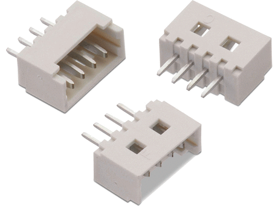
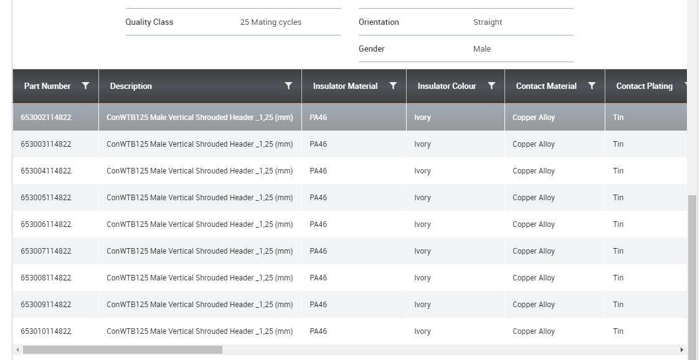

# Place 3D body in Altium Designer

Altium Designer版本：AD 18.1.7

## 1、效果对比

有3D模型的板子示意图如下，Altium designer工程文件在[Place_3D_body](./PrjPCB)中。

  

无3D模型的板子示意图如下。  

  

## 2、方法

- 画好元器件封装
- 到[3D模型网站](http://www.3dcontentcentral.com/)下载需要的模型，下载前先注册账号。  
  1. 在后侧搜索框中输入需要的模型关键字；  
    
  2. 在出来的列表中，点击需要的模型；  
    
  3. 修改Format为.STEP的格式，将Zipped的勾去掉，不需要下载为压缩包格式，再点击download下载模型，得到*.step的文件。  
    
- 放置3D模型。
  1. 点击place - 3D body  
    
  2. 出现十字光标后，按tab键调出属性框Properties，将3d Model Type的Exruded改为Generic（下图中的1），再点击source栏下的choose（下图中的2），选择刚刚下载的*.step文件。  
    
  3. 将图像调整到合适位置，单击左键将3D模型放下。按快捷键3，查看3D模型，如果模型角度方向有问题，可以双击3D模型，在Properties下的3D Model Type 中调整3维角度，standoff Height可以调整模型离焊盘平面的距离（上图中的3）。  
  效果图对比：  
    
    
  4. 保存。
  
## 3、不好找的元器件

  1. [1.25mm间距的接线插头](https://www.3dcontentcentral.cn/secure/Download-Partner-Model.aspx?partner=TraceParts&name=W%c3%9cRTH+ELEKTRONIK+-+ELECTROMECHANICAL+COMPONENTS+-+WTB-Wire+to+Board+-+Wire+to+Board+-+1.25+mm+-+PCB&lang=zh&catalogid=10831&id=601662&parturl=https%3a%2f%2fwww.traceparts.com%2fels%2f3dcc%2fgoto%3fProduct%3d10-05032015-067692%26configuratorType%3dtable%26showBomFields%3dtrue%26showSlides%3d3Dviewer%2cPictures%2cDimensionDrawings%2cECAD%26tp_p1%3d%7b1%7d)  
    
  下拉可以选择不同引脚数。  
  
