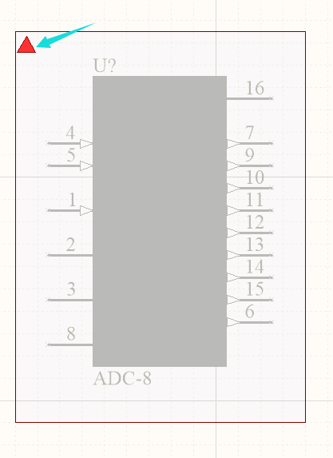
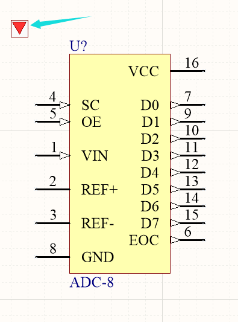

# Compile Mask in Altium Designer

Altium Designer版本：AD 18.1.7

在绘制原理图时，如果有某一部分想暂时删掉，但后续有可能会使用，可以使用编译屏蔽功能，将其暂时屏蔽。  

工具栏 Place - Directives - Compile Mask  

## 参考地址

[Altium Designer笔记之编译屏蔽/Compile Mask](https://blog.csdn.net/molake10344/article/details/48153919)
