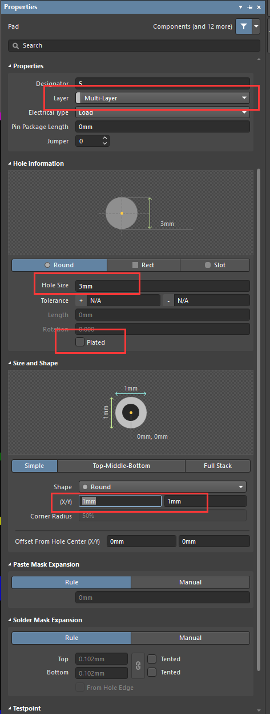

# NPTH in Altium Designer

Altium Designer版本：AD 18.1.7

无铜安装孔(Npth):螺丝孔或期间塑料固定脚，无电气属性，起定为固定作用。

如果螺丝孔不需要镀铜，可以使用Npth孔。  
先放置一个PAD，双击修改属性。  

layer选择Multi-layer；  
Plated勾去掉，金属控与非金属孔的属性区别为`Plated`是否有勾选，如果孔勾选`Plated`那么孔的属性为金属，如果不勾选就是非金属孔；  
将Hole Size设置比Shape值大，其中Hole Size的大小就是孔的大小。

`注意：`孔径不要选择刚好螺丝的直径，尽量将孔径做大0.1mm，否则到时候做出来的孔会塞不进螺丝。（主要看供应商制板偏差以及螺丝孔直径公差）

  

## 参考

[扫盲篇：PCB设计钻孔知识详解](https://mp.weixin.qq.com/s?__biz=MjM5NjIzMDkwMQ==&mid=2651636086&idx=2&sn=96697cccc961b99caf10690a473d6032&chksm=bd1402ec8a638bfaadc5f5d6f79b2838cd47236da9832f85004f9641ad234231622e6f9cd860&mpshare=1&scene=23&srcid=&sharer_sharetime=1568084616301&sharer_shareid=b6d018b8e3d9b55e4636e277f385cb7b#rd)

[altium designer画螺丝孔也就是固定孔之问答](https://www.cnblogs.com/windworld17/p/4763584.html)
