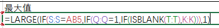

# excel_array_formula

>注：公式均以CTRL+SHIFT+ENTER三键结束输入。

[large函数](https://support.office.com/zh-cn/article/large-%e5%87%bd%e6%95%b0-3af0af19-1190-42bb-bb8b-01672ec00a64?NS=EXCEL&Version=16&SysLcid=2052&UiLcid=2052&AppVer=ZXL160&HelpId=xlmain11.chm60373&ui=zh-CN&rs=zh-CN&ad=CN)  
返回数据集中第k个最大值。  

[if函数](https://support.office.com/zh-cn/article/if-%e5%87%bd%e6%95%b0-69aed7c9-4e8a-4755-a9bc-aa8bbff73be2?NS=EXCEL&Version=16&SysLcid=2052&UiLcid=2052&AppVer=ZXL160&HelpId=xlmain11.chm60049&ui=zh-CN&rs=zh-CN&ad=CN)  

[is函数](https://support.office.com/zh-cn/article/is-%e5%87%bd%e6%95%b0-0f2d7971-6019-40a0-a171-f2d869135665?NS=EXCEL&Version=16&SysLcid=2052&UiLcid=2052&AppVer=ZXL160&HelpId=xlmain11.chm60177&ui=zh-CN&rs=zh-CN&ad=CN)  

  
