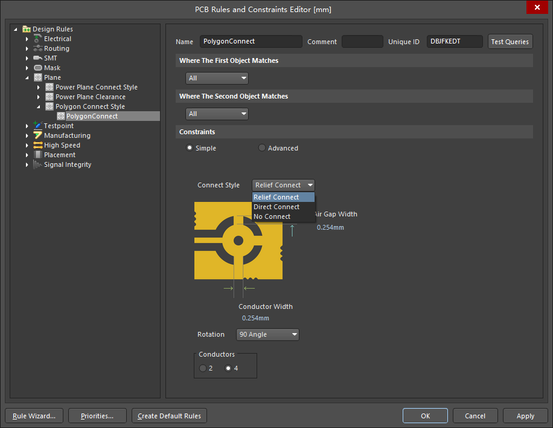

# Polygon_Connect

Altium Designer版本：AD 18.1.7

菜单栏 Design -> Rules -> Plane -> Polygon Connect Style内可以看到，敷铜连接类型分为三种，Relief Connect、Direct Connect和No Connect。  

  

当排针、电阻、电容等元器件有焊盘需要接地时，建议使用Relief Connect方式，这样在焊接的时候，会相对简单。如果使用Direct Connect全覆盖方式，则会因为大面积铜箔，导致焊接位置散热较快，操作会变麻烦，需要更换大功率烙铁或调节焊台的温控旋钮。  

其余放置在板子周围的接地过孔，不需要焊接，则可以使用Direct Connect的方式全覆盖。  

## 参考

1.[Altium Designer 13 设计备忘录7——如何让过孔/地孔覆铜全覆盖](https://blog.csdn.net/ps574134526/article/details/89370635)  
2.[焊点直接连接到铺铜会导致传热太快不好焊么？](http://bbs.eeworld.com.cn/thread-1128592-1-1.html)
