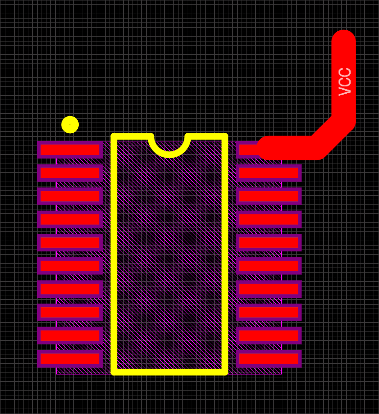
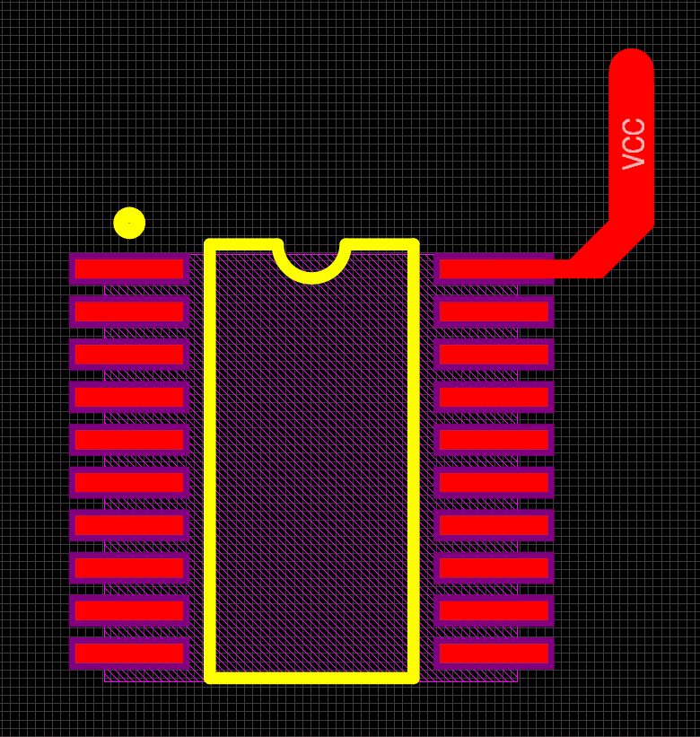

# Small_Pad_with_Wide_Line

Altium Designer版本：AD 18.1.7  

当走线较宽，而焊盘较小时，常常会出现这种现象。  

  

这样走线会导致该焊盘与相邻的焊盘在焊接的时候容易焊接在一起。  

可以绘制成下面这样：  

  

细线的距离要尽量短。  

首先点击顶部工具栏“Tools"--"Preferences"。  

在“Preferences"框的左边选择"PCB Editor"--"Interactive Routing"，再在右边找到"Automatically Remove Loops"，将勾去掉。  

>注意：等画完以后，将勾打上，不然在别的地方有重复叠加的导线时，系统不会将其修改成单独的导线。  

然后按照动图中的步骤画导线，尽量使线条过渡平滑，走线边缘不要出现锯齿，内部不要出现空洞。  

  
