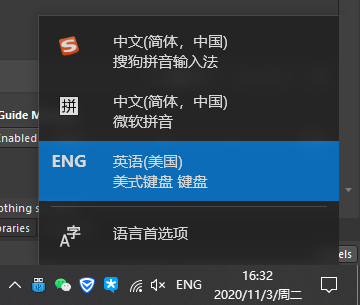

# Routing Corners

Altium Designer版本：AD 18.1.7

圆弧走线。  

快捷键<kbd>shift</kbd>+<kbd>space</kbd>，可以改变走线模式。  

  

在切换的时候，需要将输入法状态切换成美式键盘。

  

## 参考

[Altium Designer如何圆弧走线](https://blog.csdn.net/yueniaoshi/article/details/49687463)  

[Altium Designer 10画不了圆弧走线](https://bbs.21ic.com/icview-604631-1-1.html)  
