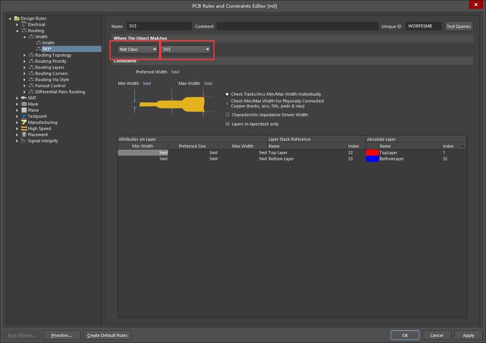

# Parameter Set

Altium Designer版本：AD 18.1.7

顶部工具栏选择，或者右键place - Directives内选择。  
  

  

1. parameter set 和 rules
  第一种使用方法，放置一个parameter set在导线上，并在Rules框内，建立一个规则，如线宽5mil。  
    
  导入到PCB后，在规则框内，会直接出现设置的规则，且优先级处于最高一级。从规则中可以看到，3V3这个net的规则全部受限于此规则。  
    

2. parameter set 和 Blanket
  第二种使用方法，结合Blanket使用。  
  Blanket菜单栏与parameter_set一致，放置的时候，先左键选择起点，移动鼠标选择区域，并左键确定第一条线条，最后右键确定。如果想要不规则图案，则移动鼠标再左键选择区域，最后右键确定，如果在起点两次左键，会建立不了。  
    
  一种方式是与之前一样，建立rules，则框内的所有都受限于建立的规则。  
  还有一种方式是，建立class，然后在规则内自己建立规则，同时选择net class。  
    

## tips

  1. 规则存在优先级，修改规则优先级，在规则左下角的priorities内修改。  

  2. 打印原理图PDF时，如果不想要输出parameter_set和Blanket，在使用smart PDF时，将其勾去掉。  

    

## 参考  

  [PCB之AD规则设置技巧](https://blog.csdn.net/qq_18628523/article/details/99317668)  
  [关于AD绘制驱动板如何设置电气间距](https://blog.csdn.net/hurryuptowang/article/details/110306328)  
  